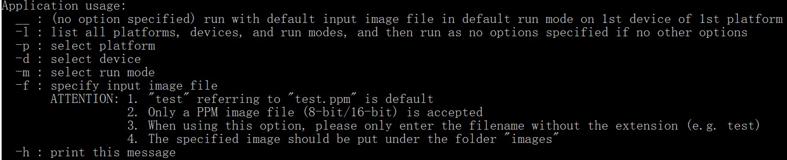

# [UoL_Y3S2_PP](https://github.com/ArvinZJC/UoL_Y3S2_PP)/Assessment 1

The project is named as **Assessment 1** which contains a simple digital image enhancement tool as Assessment 1 of the course **Parallel Programming** during Semester 2 of Year 3 of BSc (Hons) Computer Science in UoL. It can basically apply image histogram equalisation on an RGB image (8-bit/16-bit). Info of test images is detailed in Table 1.

| Name | Bit depth | Width (px) | Height (px) | Spectrum |
| :-- | --: | --: | --: | --: |
| test.ppm | 8 | 1024 | 683 | 3
| test_large.ppm | 8 | 5184 | 3456 | 3
| monochrome1.ppm | 16 | 490 | 600 | 3
| monochrome2.ppm | 16 | 3758 | 2134 | 3
| colour1.ppm | 8 | 512 | 512 | 3
| colour2.ppm | 8 | 3742 | 2485 | 3
| colour3.ppm | 16 | 600 | 729 | 3
| colour4.ppm | 16 | 4000 | 3000 | 3

Table 1

## Usage

The following steps show a basic and suggested way to run an application.

1. Build/Rebuild the solution.
2. Using the command prompt, navigate to the directory containing your built project (e.g. `cd C:\SD\C++\UoL_Y3S2_PP\x64\Debug\Assessment 1`) and run the EXE file (e.g. `"Assessment 1.exe"` - ".exe" can be omitted).
3. Figure 1 shows application usage using command line options.
Figure 1